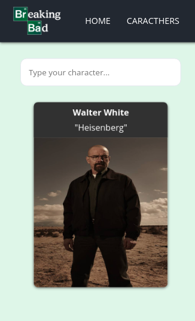

# Breaking-Bad - React

> This project was made using **React**, **HTML**, **CSS** and **JavaScript-Vanilla**. Also, I used ***styled-components** to do some of my CSS style, I used axios to get Breaking Bad API and I made a ***mobile responsive*** page. The objective was to understand and improve my skills using these tools.

### Site
The website has been hosted at netlify: https://breaking-bad-api-site.netlify.app/

### Mobile

## How to Run this Project

- git clone "https://github.com/joaorpereira/breaking-bad.git"
- npm install
- npm install styled-components
- npm install axios
- npm start

## Versions

- node: v12.18.3

## Reference Material

- <a href="https://breakingbadapi.com/" target="_blank">Breaking Bad API</a>
- <a href="https://www.youtube.com/watch?v=YaioUnMw0mo" target="_blank">React App - Breaking Bad API</a>
- <a href="https://www.treinaweb.com.br/blog/css-aprenda-a-criar-o-efeito-de-flip-cards/" target="_blank">How to make flip cards</a>

## License

- **[MIT license](http://opensource.org/licenses/mit-license.php)**
